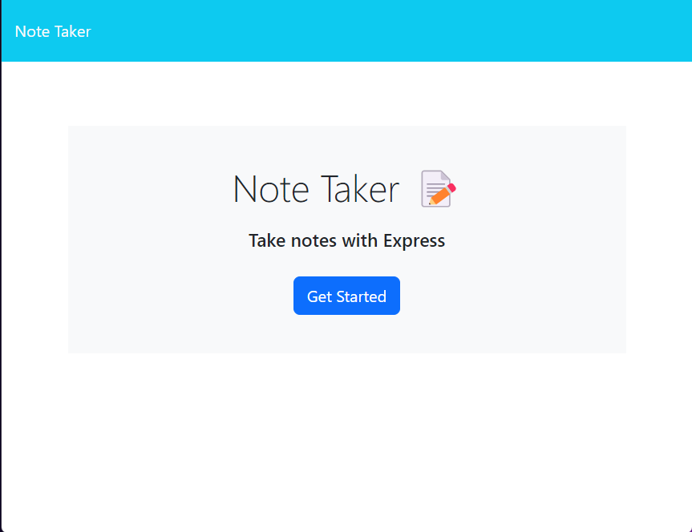
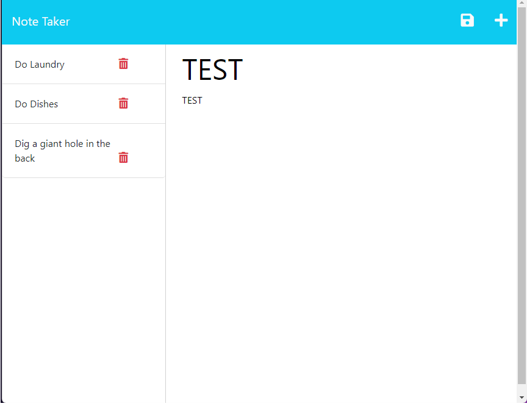

# NotesKeep

## Description

This is a simple note taking application that allows you to write and save notes that you can access at a later time.
## Table of Contents

- [Application](#application)
- [Usage](#usage)
- [Screenshots](#screenshots)
- [License](#license)
- [Contributing](#contributing)
- [Questions](#questions)

## Application

[Deployed Application](https://limitless-depths-43205.herokuapp.com/)
[GitHub Repository](https://github.com/hvansalisbury/noteskeep)
## Usage

When the app loads, click on get started. From here you can view the notes on the left column. By clicking on any of the saved notes, the complete note will appear on the right side. You can also delete the saved notes by clicking on the trash can icon. If you are already viewing a note and wish to write a new note, click on the "+" icon in the top right. Both the title and text of the notes are now editable. Once you enter a title and note text, a save icon will appear on the top of the screen which you can click on to save.

## Screenshots

## License

This application is covered under the [MIT License](https://choosealicense.com/licenses/mit) license.

## Contributing

At this time, I am not looking for any additional contributors for this project.

## Questions

Should you have any questions, please reach out to me on my [Github Profile](https://github.com/hvansalisbury).
